# BATTLESHIPS - MAN V MACHINE

This is a Python terminal game which runs in a mock terminal on Heroku. The mock terminal was created by the Code Institute and allows the user to play the game through a web browser.
The game uses the traditional battleship rules where one player tries to guess the other player's ship coordinates in order to sink the opposing players ships. The opposing player in this version of the game is the computer.

The game can be played here - https://ms3-project-battle-ships.herokuapp.com/

## How to play:

Battleships - Man v Machine is based on the well known traditional Battleships game. In this version of the game, each player has a board representing a grid in which there are 4 ships, each occupying its own square within the grid. The game begins after the user enters their name. The objective for each player is to guess the location of the other players ships by entering a row number followed by a column number. If the coordinates entered by the player match the coordinates of the other players ships, then that ship will be destroyed, and the player will score one point. The first player to score 4 points will win the game. If both players score 4 points simultaneously, the game will end in a tie. 
The computer's ships are not visible to the user, hence the requirement for the user to guess the location. The location of each player's ships are set randomly. The guesses made by the computer are also random, while the users guesses are entered manually by the user.
When a ship is hit, the corresponding coordinate on the player's board will display a "*" symbol. A missed guess will be represented by an "x" and the ships on the user's board are represented by the "@" symbol. After each player makes a guess, both players boards will be displayed, showing whether they hit or missed their target and a text message will also inform the user of the coordinates chosen by both players, whether they hit or missed and what the score current score is. The user will then be prompted to choose to continue playing or to quit the game. If either player reaches a score of 4, the game will end, though the user will be presented with an option to play again.

## Existing Features:
* Input for user name

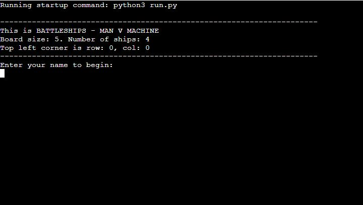

* Randomly generated ship locations printed to console.

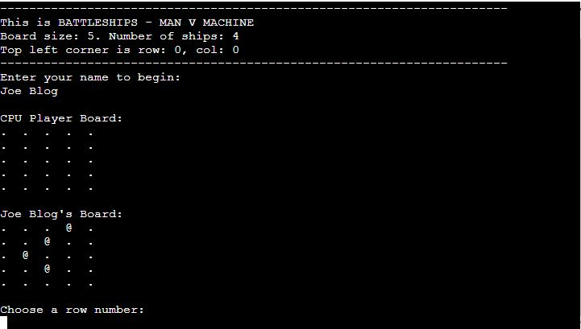

* Data validation preventing the user from coordinates outside the range of the board.
* Data validation preventing the player from entering a string value instead of numeric values for the player's guess.

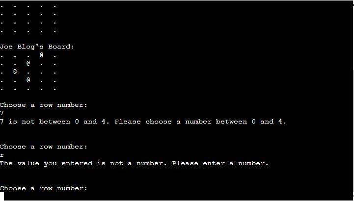

* Data validation prevents the same coordinates being guessed more than once.

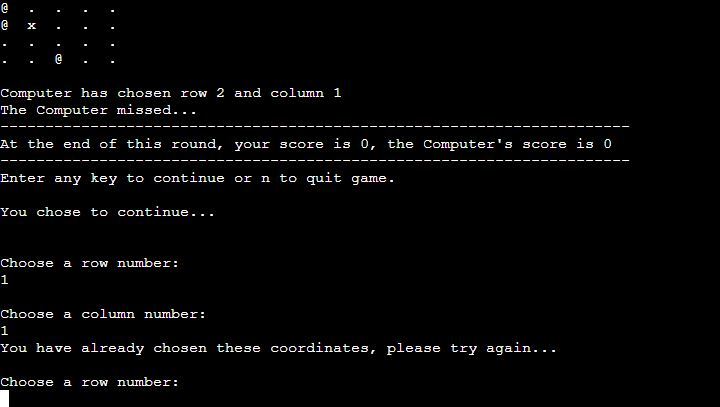

* Randomly generated computer guesses.
* User is updated with score at the end of each round.
* Player boards are updated following each round.
* User is updated with guesses made by both players at the end of each round.
* Scores are incremented between rounds.
* User is given an option to quit or continue at the end of each round or at the end of each game.

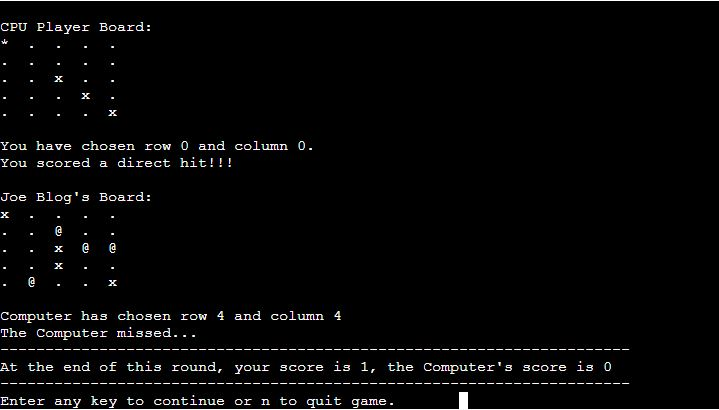

## Future Features:
* Text based imagery to illustrate when a ship is hit
* Best-of-three type score counting system
* Game summary showing time spent playing and number of guesses made

## Data Model:
I used a series of lists to store the game data. There is a list for the computers and players ship locations, guesses, player boards and variables for the scores and the player's name.

## Testing:
* Every coordinate from (0, 0) - (4, 4) entered to ensure the values on the board update with an x.
* Played countless rounds to ensure all coordinates update with an "x" for a miss and "*" for a hit.
* Played game through to end of round numerous times to ensure that the game win/game lose messages printed correctly.
* Checked that the player is presented with an option to continue or quit after each round and after each game.
* Checked that the player's name is displayed above the player board after being input by the player.
* Checked that data validation for user inputting row and column numbers raised an error if text or values above 4 and below zero were input or text was input instead of an integer.
* Checked that all game values were cleared correctly at the beginning of a new game.
* Checked that the player and CPU score incremented correctly after each round.
* Checked that the player's board displayed the randomly generated ship positions correctly after being printed.
* Checked that the player and CPU coordinate guesses text messages were printed with the correct values.
* Checked that the player and CPU guesses were stored correctly and could not be used twice in the same round.
* Checked that the coordinates chosen by the player and CPU were checked against the ship/target coordinates correctly, and displayed the correct hit/miss message if the values matched/ didn't match.
* Code was checked using PEP8 online with no errors found.

## Solved Bugs:
1. I was trying to print the player board after each turn. I had been using the append method to mark the board with an x, but this was causing two boards to be printed. I used the extend method instead to update the board before printing.  This fixed the bug and the programme was now printing one updated board instead of two.

2. I tried using a for loop to compare a list (player guess) with lists inside another list (CPU ship locations). But it appeared that this function would only match the player guess with the first index of the CPU ship locations list. I then tried using the 'for x in list' loop, and it worked as I intended, where the player guess value could be matched with any of the values in the CPU ship locations list and not just the first one.

3. I wanted to increment the player score variable each time a ship was hit, but I couldn't update the global variable from inside the function . After a fair amount of googling I found a suggestion to put the 'global' key word in front of the variable  inside the function, and sure enough, it worked.

4. After each round, a message is displayed showing what coordinates were guessed by both the player and the CPU. I noticed that the player's board appeared to be printing the CPU's guesses opposite to the coordinates printed in the message. Initially, I thought the error was being caused by the print updated player board function. However, I soon found that the arguments for the message function were in the wrong order (column value before the row value). I changed the order of the arguments, and now the coordinates in the message match those on the updated board. 

5. I added a function to allow the user to choose to play a new game or quit when a game had been completed. I included a function to reset all game variables or lists to empty or zero. However, when the new game was played, the old boards were printed alongside the new boards. This was similar to a bug I experienced previously. I discovered that I had forgotten to add some lists to the reset function. Once I added these lists, the new game printed the boards as correctly.

6. During testing of playing beyond one round, I found that the game would malfunction in that the CLI would accept any input but would not provide any feedback at all. This bug would occur after a few guesses were made by the player. The number of guesses before the game hung varied. Eventually I realised that this was because one of the lists that stored all the guesses made by the CPU was not cleared at the end of round one. So once all the remaining coordinates not yet picked by the CPU were eventually picked, the CPU was not able to make more guesses. Adding this list to the function for resetting the CPU's guesses at the end of a round fixed this bug. 

## Remaining Bugs:
* None that I'm aware of.

## Validator Testing:
* PEP8 online was used to test the code. No errors were found.
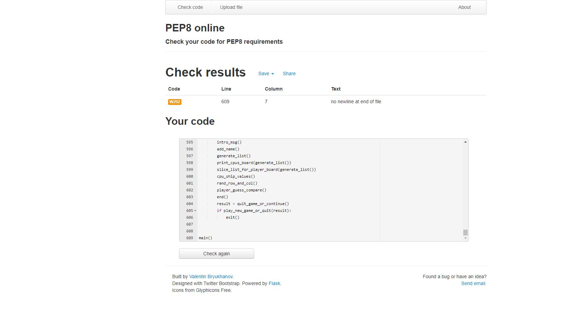

## Deployment:
1. Log into Heroku.
2. Click "new".
3. Click "create new app".

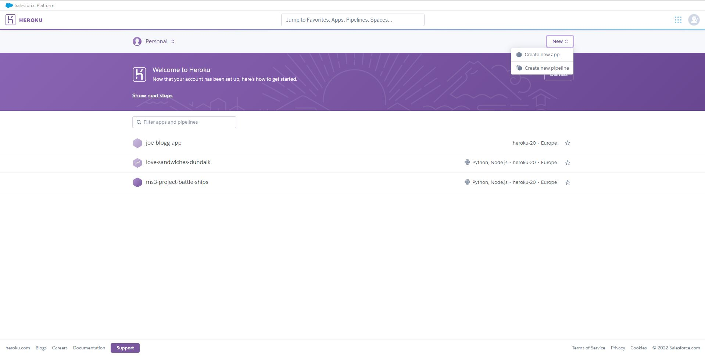

4. Under "app name" type in whatever you wish to name your app.
5. Click "create app".

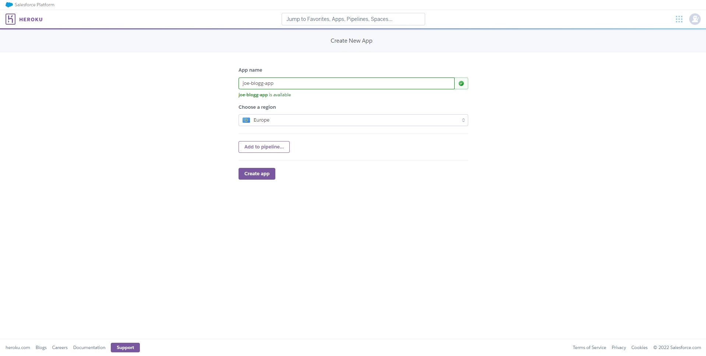

6. Click "settings".
7. Click "add build pack".

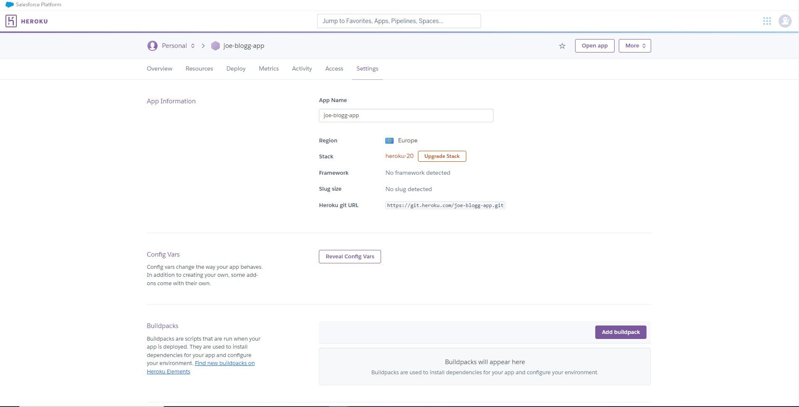

8. Click "Python" then click "save change".
9. Click "add build pack" again.
10. Click "NodeJS" then click "save change".

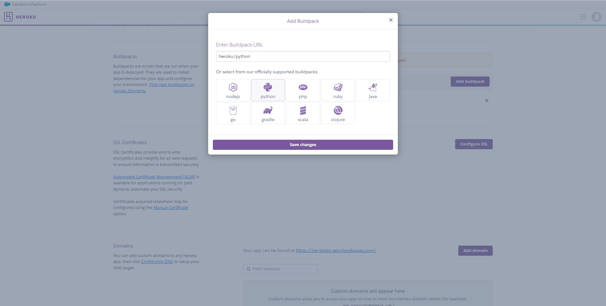

11. Ensure Python now displayed above NodeJS. You can drag and drop the Python icon to rearrange the order if neccessary.

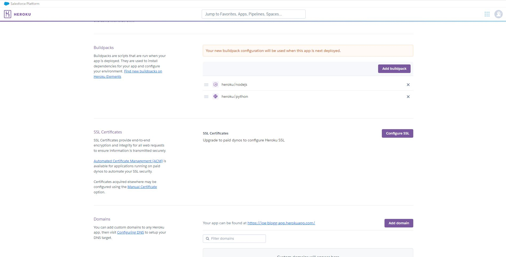

12. Near the top of the page, click "deploy".
13. Find "deployment method" on the left of the screen and click on "connect to Github".
14. Type repository name into the search bar and click "search".
15. Click "connect".

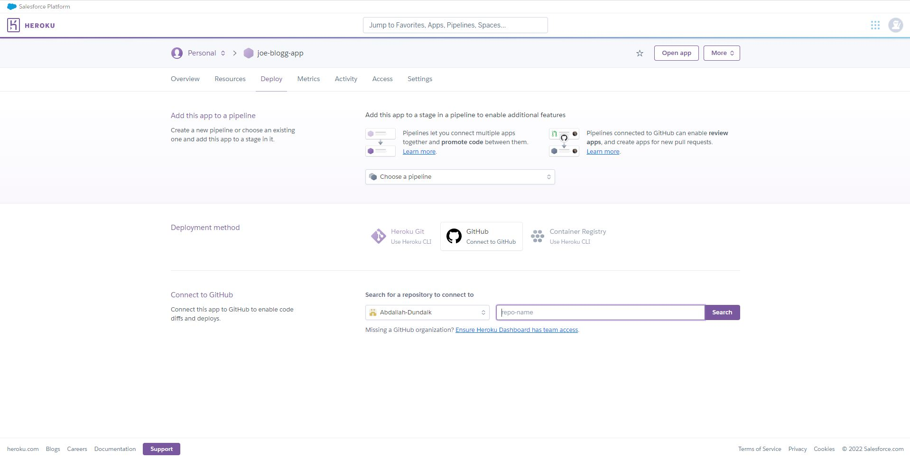

16. Scroll down to "deploy Github branch" and use drop-down menu to select branch you wish to deploy.
17. You can click either "Enable automatic deploys" if you want to build the heroku app automatically each time you push a new change to your code to Github, or you can click "deploy branch" to manually build the app. 

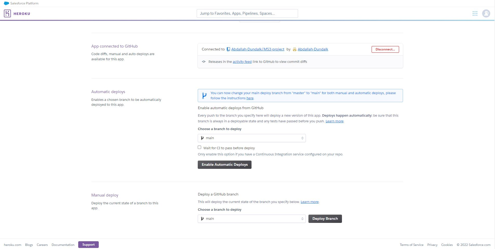

18. Assuming you have chosen to manually "deploy branch", click "view" when the app has finished building.

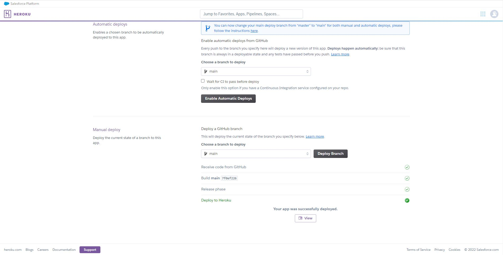

19. Here is the finished app.

## Credits:

* Clifford von Wickler, the creator of the opriginal Battleships game.
* Deployement terminal by Code Institute.
* My mentor Gurjot Singh for being such a great listener.
* W3Schools.com for quick refreshers.
* entechin.com for teaching me how to print without brackets and and commas.
* stackoverflow for ideas for for loops.
* Code intitute for providing the knowledge to allow me to code and keeping me on track regarding deadlines.
